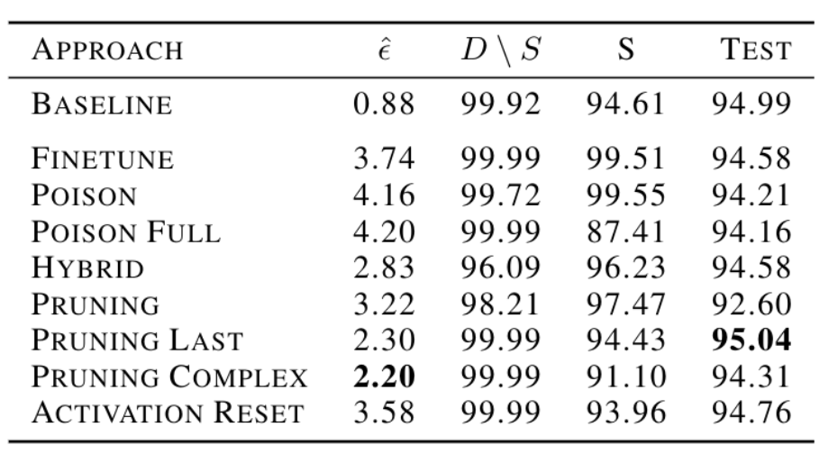

# Forget with Precision: Assessing Machine Unlearning Approaches


## Overview

This project explores the emerging field of Machine Unlearning, which aims to selectively remove data from trained deep learning models while preserving overall performance. We evaluate various unlearning approaches, ranging from established techniques like finetuning and poisoning to novel methods like Pruning Complex, using a rigorous experimental framework on ResNet-18.

By Max Krähenmann, Leo Neubecker, Virgilio Strozzi, and Igor Martinelli at ETH Zürich (2023).

## Abstract

Machine Unlearning aims to induce a model to forget a portion of the dataset on which it has been trained. This work explores various unlearning approaches, utilizing combinations of finetuning, label poisoning, pruning, and re-initialization, resulting in a total of eight distinct methods.

These methods undergo evaluation on the ResNet-18 architecture trained on CIFAR-10 and AgeDB for considerations of computational efficiency, accuracy, and forget quality. For the last criteria, a novel metric inspired by the Likelihood-Ratio attack is developed to assess unlearning effectiveness. Furthermore, two novel unlearning approaches, namely Pruning Complex and Activation Reset, are introduced. Among all tested methods, Pruning Complex exhibits the best forget quality under our evaluation metric.

## Methods Tested

We evaluate eight distinct unlearning methods, imposing a constraint that each approach should not take more than 5% of the time required for full model retraining (approx. 5 epochs).

### Standard Approaches
* **Finetuning on Retain Set:** Training for 5 epochs on the retain set with a low learning rate.
* **Label Poisoning:** Randomly assigning labels to the forget set and training for 1 epoch (forget set only) or 5 epochs (full dataset).
* **Two Stage Hybrid:** Initial label poisoning on the forget set followed by finetuning on the retain set to recover accuracy.
* **Selective Pruning:** Identifying and reinitializing weights associated with the forget set (using an overfitted model), followed by finetuning.

### Novel Approaches
* **Selective Pruning Last Layer:** Applying selective pruning exclusively to the last linear layer of ResNet-18.
* **Selective Pruning Complex:** A strategy that reinitializes weights shared between a model overfitted on the forget set and a model overfitted on a fraction of the retain set.
* **Activation Reset:** Reinitializing kernels that exhibit significantly higher average activation for forget set samples compared to retain set samples.

## Results



Key findings from the experiments on CIFAR-10 and AgeDB:

* **Pruning Complex** achieved the lowest epsilon (ê) value, indicating the best forget quality among all tested methods.
* **Hybrid, Pruning Last, and Activation Reset** showed a favorable balance, maintaining high accuracy on the test set while effectively reducing accuracy on the forget set.
* **Generalization issues:** Methods like Finetune and Poison showed negligible differences in forget quality on AgeDB compared to CIFAR-10, suggesting potential difficulties in generalizing across different data distributions.
* **Efficiency:** All methods adhered to the strict computational constraint of using less than 5% of the original training time.

## Key Contributions

* **Comprehensive Framework:** Defined a framework for Machine Unlearning grounded in differential privacy principles.
* **Novel Metric:** Developed a custom evaluation metric based on a membership inference attack (Likelihood-Ratio) to quantify "forgetting".
* **New Techniques:** Introduced and validated two novel methods: Selective Pruning Complex and Activation Reset.
* **Empirical Analysis:** Conducted extensive experiments using ResNet-18 on CIFAR-10 and AgeDB to benchmark efficiency, accuracy, and data removal effectiveness.

## Reproducing Results

1.  **Training the Retain Models:** run the script `scripts/train_retain.ipynb` with different seeds.
2.  **Obtaining the logits:** run the script `scripts/create_logits.ipynb`, change paths if needed.
    * To obtain the logits of the retained models, change `MODE` to `"retain"`, else to `"unlearn"`.
    * To obtain the logits for a specific approach, change the line with `unlearn.two_stage_simple` to the approach; these can be found in `machine_unlearning/unlearn.py`.
3.  **Evaluate the Approaches:** run the script `scripts/attack.py` with the following usage:
    ```bash
    python3 attack.py <data_path> <approach_name>
    ```

    The data should be organized in the following way:

    ```text
    data/
    +-- Approach1/
          +-- logits_unlearn.npy
          +-- metrics.csv
    +-- Approach2/
          +-- logits_unlearn.npy
          +-- metrics.csv
    .
    .
    +-- logits_retain.npy
    +-- metrics.csv
    ```
